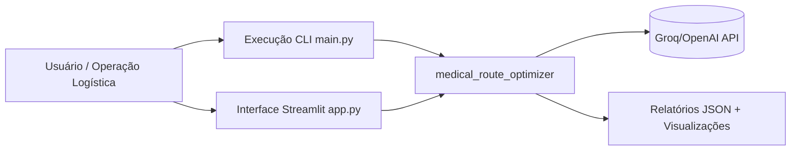
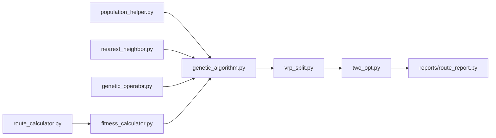
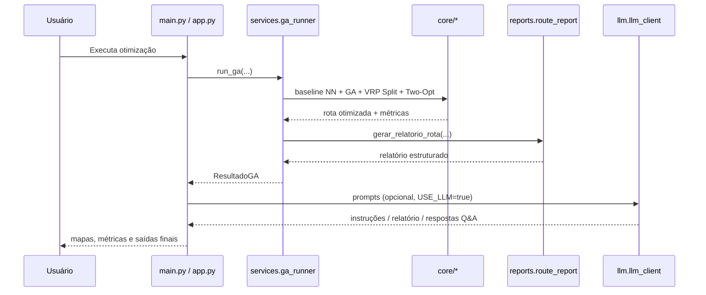

# Arquitetura — medical_route_optimizer

Este diretório concentra, em um **local único**, os diagramas arquiteturais formais do projeto.

## 1) Diagrama de Contexto (nível sistema)



## 2) Diagrama de Containers (aplicação)

```mermaid
flowchart TD
    subgraph APP[medical_route_optimizer]
        DATA[data/\ndelivery_points.py]
        CORE[core/\nGA + NN + Two-Opt + VRP Split + Fitness]
        SVC[services/\nga_runner.py]
        REP[reports/\nroute_report.py]
        LLM[llm/\nprompts + llm_client]
        UI[app.py (Streamlit)]
        CLI[main.py (pipeline)]
        VIS[visualizacao/\nplots + maps + animacao]
    end

    DATA --> CORE
    CORE --> SVC
    CORE --> REP
    SVC --> REP
    REP --> LLM
    SVC --> VIS
    CLI --> SVC
    CLI --> LLM
    UI --> SVC
    UI --> LLM
```

## 3) Diagrama de Componentes (núcleo de otimização)



## 4) Diagrama de Sequência (execução principal)



## 5) Diagrama de Implantação (mínimo)

```mermaid
flowchart LR
    subgraph LOCAL[Ambiente local (Python 3.11 + venv)]
        CLI[CLI: python -m main]
        WEB[Web: streamlit run app.py]
        PKG[Pacote medical_route_optimizer]
        FILES[(Arquivos locais\nJSON/Notebook/README)]
    end

    CLI --> PKG
    WEB --> PKG
    PKG --> FILES
    PKG --> EXT[(API LLM externa\nGroq/OpenAI)]
```

## Escopo e objetivo

Estes diagramas cobrem o conjunto mínimo recomendado para apresentação técnica do projeto:
- contexto do sistema;
- containers/camadas da aplicação;
- componentes internos do núcleo de otimização;
- sequência de execução ponta a ponta;
- visão mínima de implantação.
