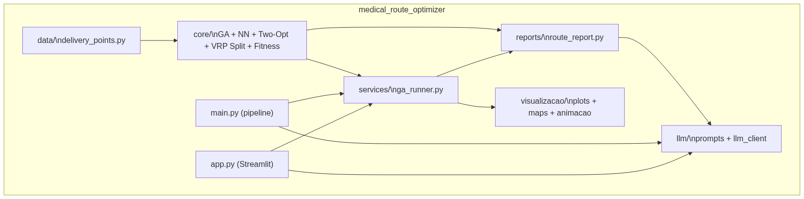
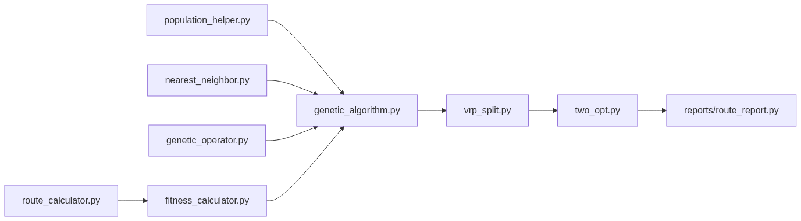
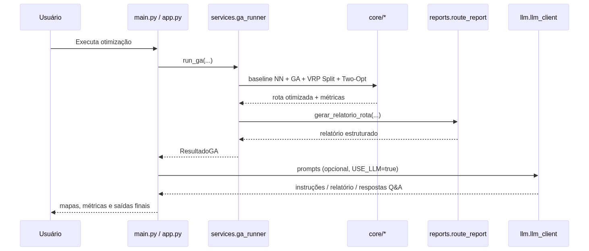
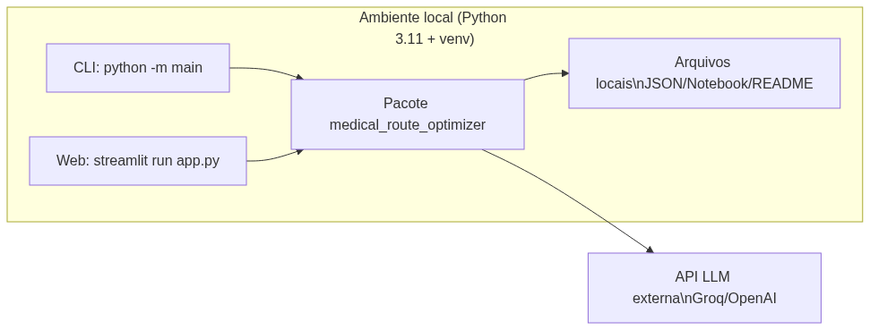

# Arquitetura — medical_route_optimizer

Este diretório concentra, em um **local único**, os diagramas arquiteturais formais do projeto.

## 1) Diagrama de Contexto (nível sistema)

## 2) Diagrama de Containers (aplicação)

## 3) Diagrama de Componentes (núcleo de otimização)

## 4) Diagrama de Sequência (execução principal)

## 5) Diagrama de Implantação (mínimo)

## Escopo e objetivo

Estes diagramas cobrem o conjunto mínimo recomendado para apresentação técnica do projeto:
- contexto do sistema;
- containers/camadas da aplicação;
- componentes internos do núcleo de otimização;
- sequência de execução ponta a ponta;
- visão mínima de implantação.
